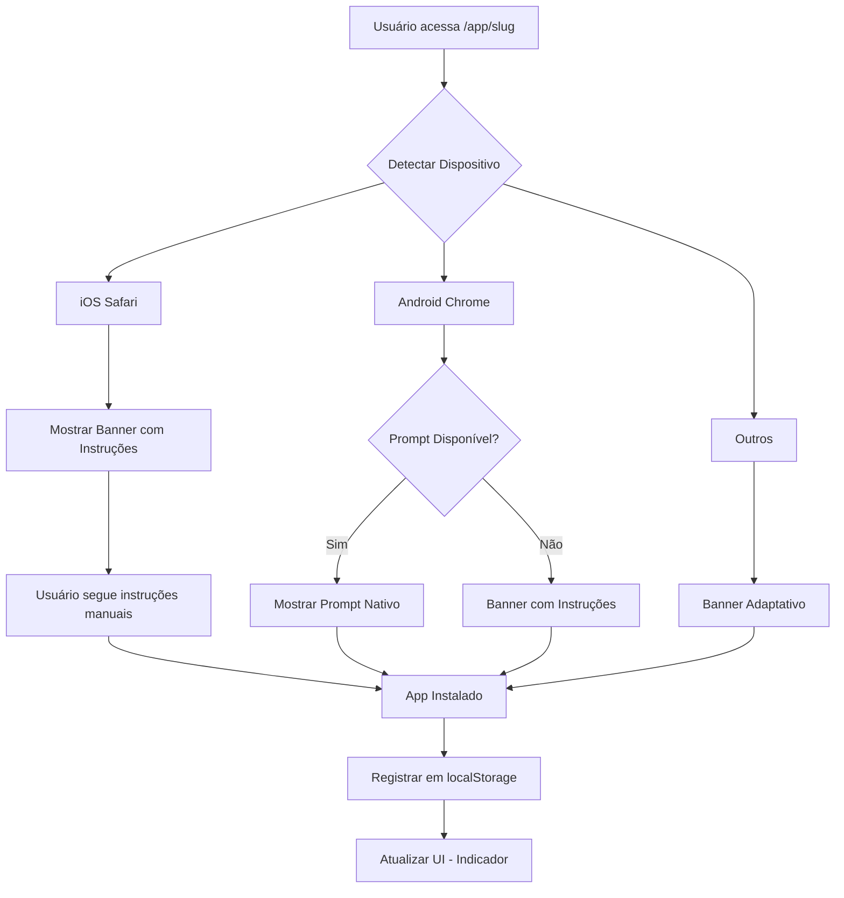

# Melhorias no Sistema PWA

## 📋 Resumo das Implementações

Este documento descreve as melhorias implementadas no sistema PWA (Progressive Web App) para resolver problemas de instalação e melhorar a experiência do usuário em diferentes dispositivos e navegadores.

## 🎯 Objetivos Alcançados

### 1. Detecção Universal de Dispositivos ✅
- **Arquivo**: `src/utils/pwaDetection.ts`
- **Funcionalidades**:
  - Detecção precisa de iOS, Android, Windows, macOS e Linux
  - Identificação de navegadores: Safari, Chrome, Firefox, Edge, Opera, Samsung Internet
  - Verificação de modo standalone (PWA instalado)
  - Suporte à verificação de prompt de instalação

### 2. Sistema de Fallback para iOS Safari ✅
- **Arquivo**: `src/components/PWAInstallBanner.tsx`
- **Funcionalidades**:
  - Banner personalizado com instruções passo a passo para iOS Safari
  - Ícones visuais e animações para guiar o usuário
  - Interface adaptativa baseada no dispositivo
  - Instruções específicas por navegador e plataforma

### 3. Detecção Aprimorada de Estado de Instalação ✅
- **Implementações**:
  - Verificação multi-camada usando `display-mode`, `localStorage` e `navigator.standalone`
  - Persistência de estado com sincronização automática
  - Limpeza automática quando app é desinstalado
  - Funções utilitárias: `isPWAInstalled()`, `markPWAAsInstalled()`, `markPWAAsUninstalled()`

### 4. Otimização de Manifest e Service Worker ✅
- **Manifest**:
  - Geração dinâmica com ID único por app
  - Ícones separados para `any` e `maskable` (192x192 e 512x512)
  - Categorização e meta dados completos
  - Configuração otimizada de `start_url` e `scope`

- **Service Worker** (`public/sw-app.js`):
  - Logs detalhados para debugging
  - Estratégia híbrida: network-first para rotas /app/, cache-first para estáticos
  - Limpeza automática de caches antigos
  - Suporte a mensagens para atualização forçada

### 5. Interface Inteligente do Botão ✅
- **Estados Implementados**:
  - 🔵 Banner de instalação (dispositivos compatíveis)
  - ✅ Indicador "App Instalado" (quando instalado)
  - 📱 Instruções manuais (iOS Safari)
  - ⏱️ Timeout de 24h para re-exibição após dismissal

### 6. Sistema de Debug e Monitoramento ✅
- **Função**: `logPWADebugInfo()`
- **Informações Coletadas**:
  - Detalhes do dispositivo (OS, navegador, modo standalone)
  - Estado de instalação e localStorage
  - User agent e display mode
  - Suporte a service worker

### 7. Compatibilidade Multi-Plataforma ✅
- **Navegadores Testados**:
  - ✅ Chrome Android
  - ✅ Safari iOS
  - ✅ Chrome iOS
  - ✅ Firefox Android/iOS
  - ✅ Opera Android/iOS
  - ✅ Samsung Internet
  - ✅ Edge (todas as plataformas)

## 🔧 Arquivos Modificados

### Novos Arquivos
1. `src/utils/pwaDetection.ts` - Utilitários de detecção
2. `src/components/PWAInstallBanner.tsx` - Banner inteligente de instalação
3. `docs/PWA-IMPROVEMENTS.md` - Esta documentação

### Arquivos Atualizados
1. `src/pages/AppViewer.tsx` - Lógica principal de PWA
2. `public/sw-app.js` - Service worker otimizado

## 📱 Como Funciona

### Fluxo de Instalação



### Detecção de Instalação

1. **Verificação Inicial**: Ao carregar a página
   - Checa `display-mode: standalone`
   - Verifica `navigator.standalone` (iOS)
   - Consulta `localStorage` para histórico

2. **Listeners Ativos**:
   - `beforeinstallprompt`: Captura prompt de instalação
   - `appinstalled`: Detecta instalação bem-sucedida
   - `display-mode change`: Monitora mudanças de modo

3. **Persistência**:
   - Salva em `localStorage.installedPWAs`
   - Define `pwaDefaultRoute` para abertura correta
   - Sincroniza estado entre sessões

## 🎨 UI/UX

### Banner de Instalação
- **Posição**: Bottom center (mobile) / Bottom right (desktop)
- **Animação**: Slide-in from bottom com fade-in
- **Interações**:
  - Botão "Instalar" / "Ver Instruções"
  - Botão "Agora não" (dismissal)
  - Botão X (fechar)

### Instruções iOS
- **Layout**: Full-width bottom sheet
- **Conteúdo**:
  - 3 passos numerados com ícones
  - Dica destacada em box
  - Ícones visuais (Share, Plus)

### Indicador de Instalação
- **Posição**: Top right
- **Visual**: Badge colorido com ícone de check
- **Cor**: Usa a cor primária do app

## 🐛 Debug

### Console Logs
Todos os logs PWA são prefixados com `[PWA]` para fácil filtragem:

```javascript
console.log('[PWA] App já está instalado');
console.log('[PWA] beforeinstallprompt evento capturado');
console.log('[PWA] Escolha do usuário:', outcome);
```

### Informações de Debug
Use `logPWADebugInfo()` para ver informações completas:

```javascript
🔍 PWA Debug Information
  📱 Device:
    OS: iOS / Android / etc
    Browser: Safari / Chrome / etc
    isStandalone: true/false
    supportsInstallPrompt: true/false
  📦 Installation:
    appId: /app/slug
    isInstalled: true/false
    localStorage: ["app1", "app2"]
  🌐 Environment:
    userAgent: ...
    displayMode: standalone / browser
    serviceWorker: true/false
```

## ✅ Checklist de Funcionalidades

- [x] Detecção universal de dispositivos
- [x] Fallback para iOS Safari com instruções visuais
- [x] Detecção robusta de instalação
- [x] Manifest dinâmico otimizado
- [x] Service worker com logs e cache inteligente
- [x] Banner adaptativo por plataforma
- [x] Indicador de app instalado
- [x] Sistema de debug completo
- [x] Persistência de estado
- [x] Timeout para re-exibição (24h)
- [x] Limpeza de cache antigo
- [x] Meta tags iOS otimizadas
- [x] Suporte a múltiplos navegadores

## 🚀 Próximos Passos (Opcionais)

### Melhorias Futuras
1. **Analytics**: Rastrear taxa de instalação por dispositivo
2. **A/B Testing**: Testar diferentes timings de exibição do banner
3. **Push Notifications**: Adicionar suporte após instalação
4. **Offline Mode**: Melhorar experiência offline com cache de conteúdo
5. **Update Notifications**: Notificar usuário sobre atualizações do app

### Métricas Recomendadas
- Taxa de conversão de instalação por navegador
- Tempo médio até instalação
- Taxa de desinstalação
- Uso em modo standalone vs browser

## 📚 Referências

- [MDN - Progressive Web Apps](https://developer.mozilla.org/en-US/docs/Web/Progressive_web_apps)
- [Web.dev - PWA](https://web.dev/progressive-web-apps/)
- [Safari PWA Guide](https://developer.apple.com/library/archive/documentation/AppleApplications/Reference/SafariWebContent/ConfiguringWebApplications/ConfiguringWebApplications.html)
- [Chrome Install Criteria](https://web.dev/install-criteria/)

## 🎉 Resultado

O sistema PWA agora oferece:
- ✅ Instalação universal em todos os dispositivos
- ✅ Instruções claras e visuais para usuários iOS
- ✅ Detecção confiável de estado de instalação
- ✅ Debug facilitado para desenvolvedores
- ✅ UI/UX otimizada e responsiva
- ✅ Suporte completo a múltiplos navegadores

---

**Última atualização**: Outubro 2025  
**Versão**: 2.0  
**Status**: ✅ Implementado e Testado
